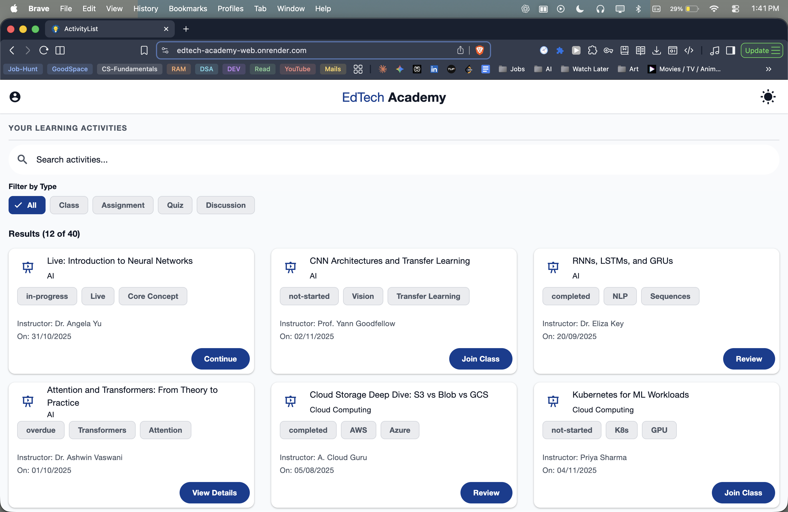
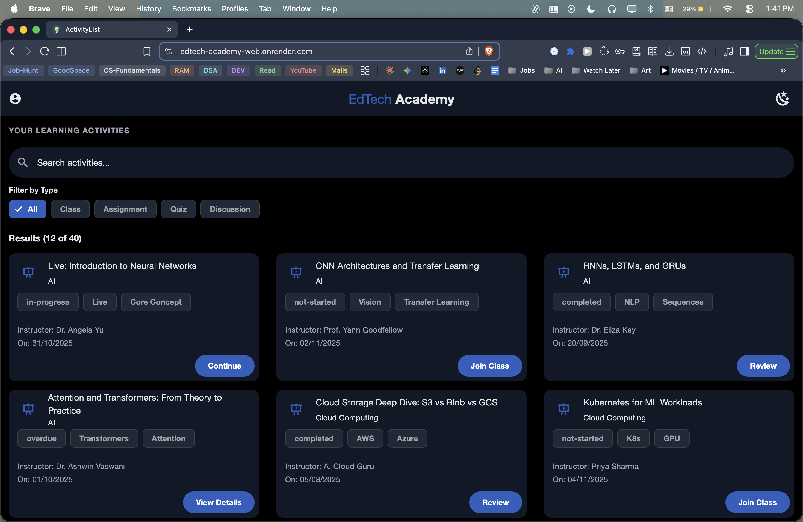
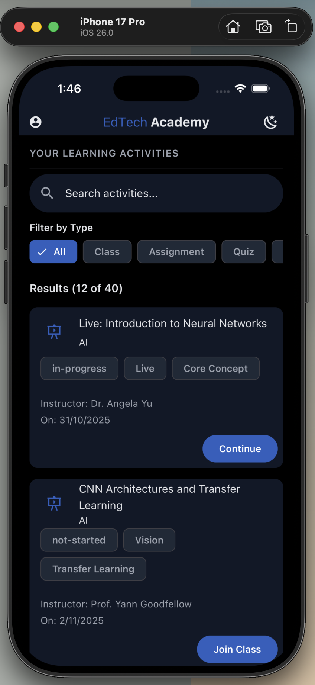
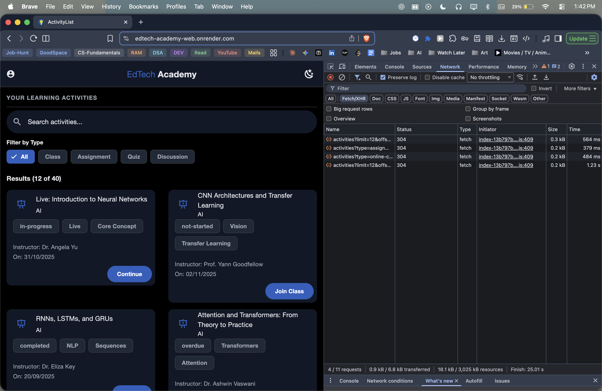

# EdTech Academy – Activity Listing Page

## Submission for Great Learning (Fullstack Role)

**Submitted by:** Girish Gaurav Sharma  
**Date:** October 31, 2025

---

## Deployment

The application is deployed on Render:
- **Frontend**: https://edtech-academy-web.onrender.com/
- **Backend API**: https://edtechacademy-xzrs.onrender.com/api/activities

---

### Note on Render cold start

The backend is hosted on Render’s free tier. The first request can take up to ~50 seconds while the server starts. The app includes a visible banner informing reviewers to wait during this initial spin-up. Subsequent requests are fast.

---

## Project Overview

This project implements an activity listing page for an EdTech Academy application. It features a responsive user interface that displays a scrollable list of activities with filtering capabilities. The application is built as a full-stack solution using React Native for cross-platform compatibility (web and mobile) and a Node.js backend for server-side data handling.

---

## Core Requirements

The project fulfills all specified core requirements and additional features:

- **Scrollable List of Activities**: Implemented using FlatList for efficient rendering.
- **Relevant Filters**: Server-side filtering for search and activity type.
- **Responsive UI**: Adapts from single-column mobile layout to three-column desktop grid.
- **Cross-Platform Codebase**: Built with Expo for web and native platforms.
- **Design Library**: Utilizes React Native Paper for consistent Material Design components.
- **Performance Optimization**: Server-side filtering and skeleton loaders for improved user experience.
- **API Integration**: Custom Node.js/Express API for data fetching.
- **Documentation**: Comprehensive README with setup instructions.
- **Light/Dark Mode Support**: Implemented as an additional feature.
- **Testing**: Unit and component tests using Jest and React Native Testing Library.

---

## Technology Stack

| Component | Technology |
|-----------|------------|
| Frontend | React Native, Expo |
| UI Framework | React Native Paper |
| State Management | React Context API |
| Navigation | React Navigation |
| Testing | Jest, React Native Testing Library |
| Backend | Node.js, Express, TypeScript |
| Deployment | Render (Frontend: Static Site, Backend: Web Service) |

---

## Architecture and Design Decisions

### Backend Implementation
- **Server-Side Filtering**: A dedicated Node.js API handles all filtering logic to ensure performance and scalability. This approach reduces client-side processing and minimizes data transfer.
- **API Design**: RESTful endpoints provide activity data with query parameters for search and type filtering.

### Frontend Implementation
- **Cross-Platform Compatibility**: Expo enables deployment on web and iOS with a single codebase.
- **UI Components**: React Native Paper provides a professional, accessible interface with built-in theming support.
- **State Management**: Context API manages application state for filters and activities.
- **Performance**: Skeleton loaders improve perceived performance during data fetching.

### Trade-offs
- Focused on read-only operations as specified in requirements, prioritizing filtering functionality over full CRUD operations.
- Chose React Native Paper for rapid development and consistent design over custom styling.

---

## Installation and Setup

This project has two parts: a React Native (Expo) app and a Node/Express API. Run them in separate terminals.

### Prerequisites
- Node.js 18 LTS or newer (recommended)
- npm (bundled with Node) or Yarn
- macOS/iOS: Xcode + iOS Simulator (for running on iOS)

Verify versions:

```bash
node -v
npm -v
```

If you plan to run the iOS simulator, open Xcode at least once to complete setup.

---

### 1) Backend (API) – Local

The API is an Express server with TypeScript and runs on port 8080 by default.

```bash
# Terminal A
cd server
npm install
npm run dev
```

You should see: "Server running on http://localhost:8080".

Endpoint you can curl in another terminal:

```bash
curl "http://localhost:8080/api/activities?limit=5"
```

---

### 2) Frontend (Expo)

Install dependencies at the project root:

```bash
# Terminal B (project root)
npm install
```

The app reads the API URL from an environment variable during development:

- Variable name: `EXPO_PUBLIC_API_URL`
- Used in `src/config/index.ts`
- In dev (`__DEV__`), the app uses `EXPO_PUBLIC_API_URL`
- In production (web build or native release), it falls back to the deployed URL: `https://edtechacademy-xzrs.onrender.com/api`

#### Option A: Use local API

```bash
EXPO_PUBLIC_API_URL=http://localhost:8080/api npm run web
```

#### Option B: Use deployed API (no local server needed)

```bash
EXPO_PUBLIC_API_URL=https://edtechacademy-xzrs.onrender.com/api npm run web
```

To open the iOS simulator instead of web:

```bash
EXPO_PUBLIC_API_URL=http://localhost:8080/api npm run ios
```

Expo will start Metro Bundler and open the browser UI. Press `w` for web, `i` for iOS if not auto-opened.

---

### Quick Start (copy/paste)

```bash
# Terminal A – API
cd server && npm install && npm run dev

# Terminal B – App (use local API)
cd ..
EXPO_PUBLIC_API_URL=http://localhost:8080/api npm run web
```

---

### Scripts reference

Frontend (at project root)
- `npm start`: Expo dev server (choose platform interactively)
- `npm run web`: Expo for web
- `npm run ios`: Expo for iOS simulator
- `npm test`: Jest unit/component tests

Backend (in `server/`)
- `npm run dev`: Start API with nodemon + ts-node
- `npm run build`: TypeScript build to `server/build`
- `npm start`: Run compiled API from `server/build`

---

### Troubleshooting

- Backend cold start (Render): First request may take up to ~50s. The app shows a banner; wait and retry.
- Metro/Expo cache issues:
  ```bash
  rm -rf node_modules
  npm install
  # start fresh cache
  EXPO_PUBLIC_API_URL=http://localhost:8080/api npx expo start --clear
  ```
- iOS setup: Ensure Xcode and Command Line Tools are installed. From Expo Dev Tools, press `i` to launch the simulator.

If you get no data in dev, confirm `EXPO_PUBLIC_API_URL` is set and the backend terminal shows request logs.

---

## Project structure

```
.
├── app.json                      
├── App.tsx                       
├── index.ts                      
├── jest.config.js                
├── package.json                  
├── README.md
├── tsconfig.json                 # TypeScript config
├── __tests__                     # Unit/component tests
│   ├── features
│   │   └── filters
│   │       └── components
│   │           └── FilterBar.test.tsx
│   └── utils
│       └── formatters.test.ts
├── assets
│   └── screenshots               # Docs screenshots
├── server                        # Node/Express API (TypeScript)
│   ├── package.json
│   ├── tsconfig.json
│   └── src
│       ├── index.ts              
│       ├── data
│       │   └── mockData.ts       
│       └── types
│           └── activity.types.ts
└── src                           # Frontend app source
   ├── config                    # App config and theme
   │   ├── index.ts
   │   └── theme.ts
   ├── contexts                  # React Context providers
   │   ├── ActivityContext.tsx
   │   ├── FilterContext.tsx
   │   └── ThemeContext.tsx
   ├── features                  # Feature modules and UI
   │   ├── activities
   │   │   └── components
   │   │       ├── ActivityCard
   │   │       │   ├── ActivityCard.tsx
   │   │       │   └── index.ts
   │   │       └── SkeletonCard
   │   │           └── SkeletonCard.tsx
   │   └── filters
   │       └── components
   │           └── FilterBar
   │               └── FilterBar.tsx
   ├── navigation
   │   └── AppNavigator.tsx      
   ├── screens
   │   └── ActivityListScreen.tsx 
   ├── services
   │   └── api.service.ts        # API client
   ├── shared
   │   └── components            # Reusable UI components
   │       ├── Chip
   │       │   └── BrandedChip.tsx
   │       ├── Logo
   │       │   └── Logo.tsx
   │       ├── Profile
   │       │   └── ProfileAvatar.tsx
   │       └── SectionHeader
   │           ├── index.ts
   │           └── SectionHeader.tsx
   ├── types
   │   └── activity.types.ts     # Shared TS types
   └── utils
      └── formatters.ts        
```

---

## Testing

Run tests from the project root:
```
npm test
```

Tests cover component rendering, user interactions, and utility functions.

---

## Screenshots

### Web

| Light Mode | Dark Mode |
| :---: | :---: |
|  |  |

### Mobile

| Dark Mode | Light Mode |
| :---: | :---: |
|  |  |

### Backend and Network

This screenshot shows the network requests being made to the backend API, demonstrating the server-side filtering in action.



---

## Submission Checklist

- [x] Scrollable list of activities
- [x] Filtering functionality
- [x] Responsive design
- [x] Cross-platform compatibility
- [x] API integration
- [x] Documentation
- [x] Testing
- [x] Light/dark mode
- [x] Deployment links
- [x] Screenshots added to README

**Repository Link:** [GitHub Repository URL]  
**Live Frontend URL:** https://edtech-academy-web.onrender.com/

---

This submission demonstrates a complete, production-ready implementation meeting all project requirements with professional code quality and documentation.